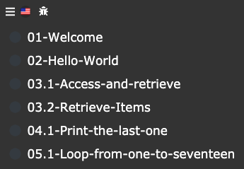

# Bienvenido a los Loops

Practicaremos los bucles en javascript para se sienta cómodo con ellos.  Recomendamos ver el siguiente video  [Breve video sobre bucles](https://www.youtube.com/watch?v=U3ZlQSOcOI0) before starting:

1. For loop.
2. forEach.
3. while.
4. map.
5. filter.
6. find.
7. Diccionario de bucles (objetos literales).

Haga click en `next →` cuando se encuentre listo para iniciar los ejercicios.

***
Si necesitas ir a un ejercicio en particular puedes seleccionar en el menu superior.

  

Y seleccionar el curso 

  

