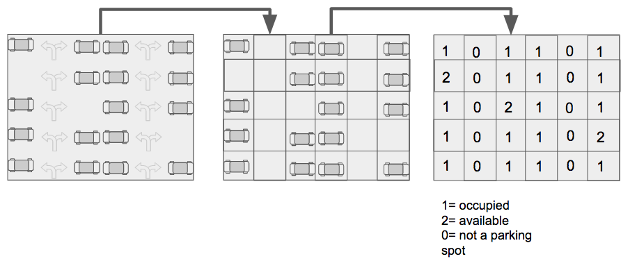

# `23` Parking Lot

We can use a 2 dimensional array (matrix) to represent the current state of a parking lot like this:




```js
parking_state = [
  [1,0,1,1,0,1],
  [2,0,1,1,0,1],
  [1,0,2,1,0,1],
  [1,0,1,1,0,1],
  [1,0,1,1,0,2],
  [1,0,1,1,0,1],
]
```
## 📝 Instructions:

1. Create a function `getParkingLotState()` that returns an object with `totalSlots`, `availableSlots` and `occupiedSlots` like the following:

```js
const state = {
     totalSlots: 12,
     availableSlots: 3,
     occupiedSlots: 9
}
```
## 💡 Hint:

+ You have to do a nested loop
